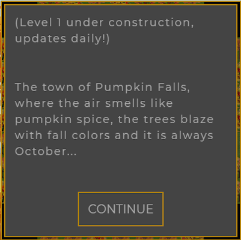
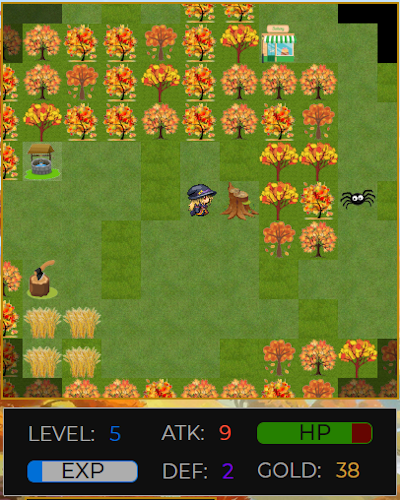

# WITCHFALL RPG - A STUDENT FINAL PROJECT

 

JUST IN TIME FOR HALLOWEEN!  
WitchFall lets you follow the adventures of Addie, the Friendly Witch.  In this Beta version, explore the town of Pumpkin Falls, where it is always October and the air smells like pumpkin spice!  This is a Halloween-themed, friendly game that our team plans to continue developing as part of our portfolio.

Based on the Open-Source framework of [React RPG](https://react-rpg.com/) by [Andrew Steinheiser](https://github.com/ASteinheiser/react-rpg.com), WitchFall is a"Work-In-Progress" RPG made with React and Redux.  The game is a turn-based, dungeon crawler that is slowly being changed to a quest system. Currently you can walk through the village in level 1, battling spiders and checking out the adorable environment.

[Play WitchFall!](https://witchfall.herokuapp.com/)   

## Requirements
-  ReactJS  
-  Node & Express  
-  MongoDB  
-  Get & Post Routes  
-  Deployed to Heroku  
-  Two New Libraries / Technologies   
    * Redux, Lodash, Sass & more!
-  User Authentication - Firebase Auth  
-  MVC Folder Structure  

### Opening screens:
 - 

### Game Controls:
 

### Tree Stumps Hold Loot & You Can Whack Spiders With Your Staff:
 &nbsp; 

### In the settings screen, you can turn the music on and off, and you can restart the game:
 

### Read more about React RPG
- [Medium: Making an RPG with React + Redux - written by the maker of the original game code!](https://medium.com/@andrewsteinheiser/making-an-rpg-with-react-redux-dcfffdb06797)

## [View Roadmap](docs/ROADMAP.md) (IN PROGRESS)

## Contributors
<!-- ALL-CONTRIBUTORS-LIST:START - Do not remove or modify this section -->
<!-- prettier-ignore -->
<table><tr>
<td align="center"><a href="https://github.com/Lucky-Cat-Gamers"> <b>Lucky Cat Gamers</b></a> </td>

<td align="center"><a href="https://github.com/GitJoeCode"> <b>Joe Shapiro</b></a> </td>

<td align="center"><a href="https://github.com/loraxgirl"> <b>Krista Clarke</b></a> </td>

<td align="center"><a href="https://github.com/duskconductor"> <b>Mark Fullton</b></a> </td>
</tr></table>

<!-- ALL-CONTRIBUTORS-LIST:END -->