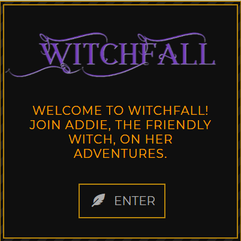
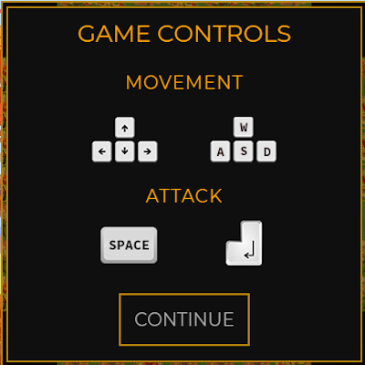

<body style="background-color:black">


# <span style="color:orange">WITCHFALL RPG - A STUDENT FINAL PROJECT</span>


 

[](#contributors)

<span style="color:orange">JUST IN TIME FOR HALLOWEEN!</span> <br>
WitchFall lets you follow the adventures of Addie, the Friendly Witch.  In this Beta version, explore the town of Pumpkin Falls, where it is always October and the air smells like pumpkin spice!  This is a Halloween-themed, friendly game that our team plans to continue developing as part of our portfolio.

Based on the Open-Source framework of [React RPG](https://react-rpg.com/) by [Andrew Steinheiser](https://github.com/ASteinheiser/react-rpg.com), WitchFall is a"Work-In-Progress" RPG made with React and Redux.  The game is a turn-based, dungeon crawler that is slowly being changed to a quest system. Currently you can walk through the village in level 1, battling spiders and checking out the adorable environment.


[Play WitchFall Here!](https://witchfall.herokuapp.com/)   

## Requirements
-  ReactJS  
-  Node & Express  
-  MongoDB  
-  Get & Post Routes  
-  Deployed to Heroku  
-  Two New Libraries / Technologies  <br>
    * Redux, Lodash, Sass & more!
-  User Authentication - Firebase Auth  
-  MVC Folder Structure  


## How To Play
<span style="color:lawngreen">Addie starts off with a staff that she can use to get rid of the pesky spiders. The space-bar or enter-key will cast a spell at the spiders.</span>

<span style="color:lawngreen">Tree stumps can hold gold, experience and even special items! Walk into the stump to trigger this. The look of the tree stump will change after you've emptied it.
</span>

<span style="color:lawngreen">In the settings folder, <ins>IF</ins> you have logged in with Google, you can 'Save Score' to add your name and level to the Leaderboard.
</span>


### Opening screens:
 &nbsp; 

### Game Controls:
 

### Game Play - You can see that one stump has been emptied, the other still has loot. Also, as we build out the game, you will be able to walk into the buildings to explore other levels:
 &nbsp; 

### In the settings screen, you can turn the music on and off, and you can restart the game. You can also save your level to see if you made it onto the Leaderboard (must log into Google first):


## How To Play Locally
Clone and fork the repo to your system.

CD into the main game folder & install all the NPM:
```javascript
npm install
```
Then CD into the client folder and do it again:
```javascript
npm install
```
Then you can run it from the client folder:
```javascript
npm run start
```

<br />

### Read more about React RPG
- [Medium: Making an RPG with React + Redux - written by the maker of the original game code!](https://medium.com/@andrewsteinheiser/making-an-rpg-with-react-redux-dcfffdb06797)

## [View Roadmap](docs/ROADMAP.md) (IN PROGRESS)


## Contributors
<!-- ALL-CONTRIBUTORS-LIST:START - Do not remove or modify this section -->
<!-- prettier-ignore -->
<table><tr>
<td align="center"><a href="https://github.com/Lucky-Cat-Gamers"><br /><sub><b>Lucky Cat Gamers</b></sub></a><br /></td>

<td align="center"><a href="https://github.com/GitJoeCode"><br /><sub><b>Joe Shapiro</b></sub></a><br /></td>

<td align="center"><a href="https://github.com/loraxgirl"><br /><sub><b>Krista Clarke</b></sub></a><br /></td>

<td align="center"><a href="https://github.com/duskconductor"><br /><sub><b>Mark Fullton</b></sub></a><br /></td>
</tr></table>

<!-- ALL-CONTRIBUTORS-LIST:END -->
</body>